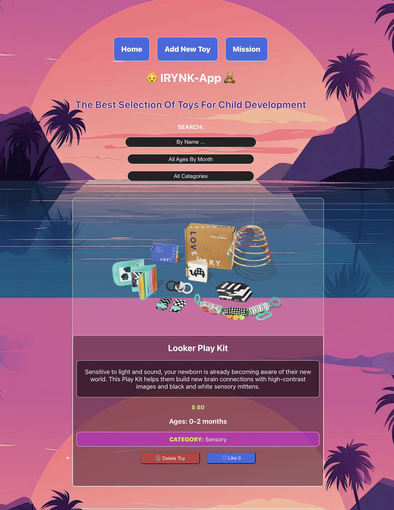

# IRYNK-App 🍼
## Toys For Child Development

As a first time, our newborn angel did not include instructions when they made their way into the world, and we have a duty to guide our little angels and help them develop their skills as they grow. This app was created to help parents witht a head start and help them choose the right toy according to age and /or category. As a first time parent of a beautiful baby girl, I think it is necessary to know what toys will help them have fun and most importantly, develop their brain as they aquire new skills..
# SETUP
Below is the set up commands in order to run the fullstack App. Add commands in order.

## CLIENT - JavaScript-REACT (Frontend Activation)

To activate the Frontend, run the following commands:
1. Run json server in your terminal:
    - `cd Client`
    - `npm run server`
2. Add a new terminal window and run this command to open the project in the browser
    - `nvm install`
    - `nvm use 20.16`
    - `npm run dev`

## SERVER - Python-FLASK (Backend Activation)

## Core Features
- A navigation bar for all client-side routes
- A search bar to quick and easily find your toy
- A form to add toys to our collection 
- The ability to select your toys by name, age and category
- The ability to like and delete toys

## Components
- App.jsx
- About.jsx
- ErrorPage.jsx
- Header.jsx
- LikeButton.jsx
- NavBar.jsx
- NewToyForm.jsx
- SearchBar.jsx
- Toy.jsx
- ToyList.jsx

## Event Listeners
- onClick
- onSubmit
- onChange

## HOOKS
- `{useState}`
- `{useEffect}`
- `{useOutletContext}`
- `{useNavigate}`

## Methods 
- GET
- POST
- PATCH
- DELETE

## Endpoints
- http://localhost:5001/toys